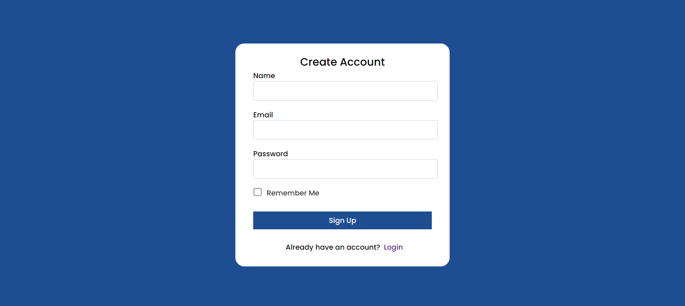
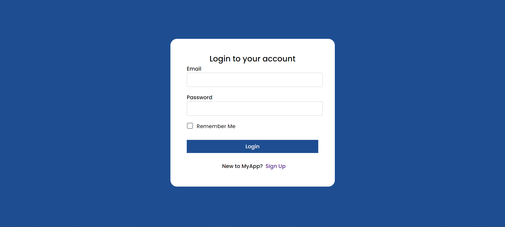
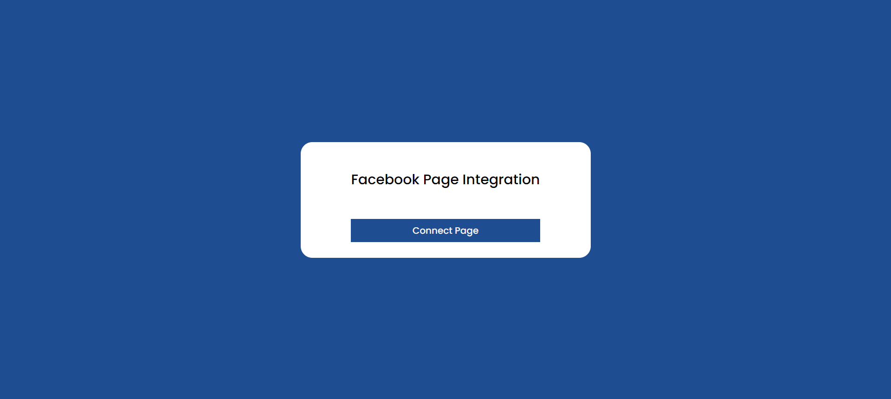
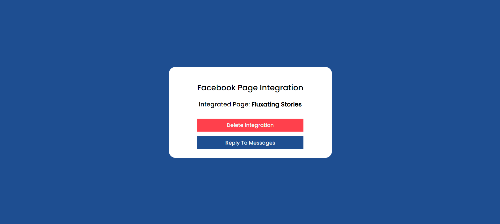
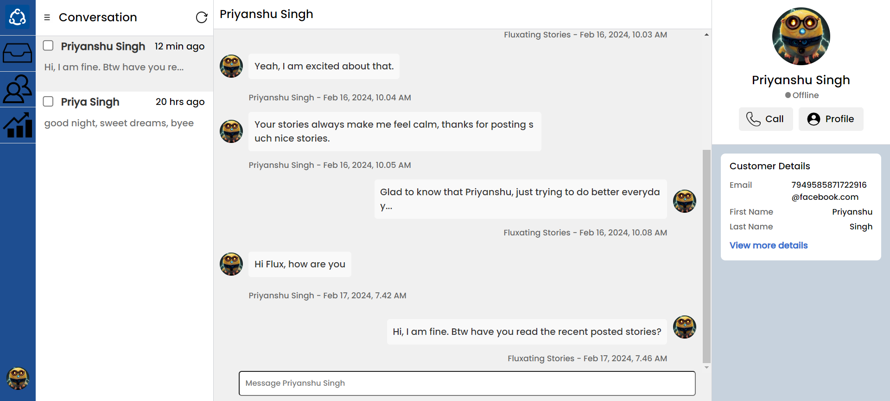

# Facebook DM Helpdesk App

This third-party application enables Facebook page owners to seamlessly manage their communication by logging into the app and connecting their Facebook accounts and pages. Through this app, users can efficiently respond to messages received on their Facebook pages using the integrated Facebook Messenger functionality powered by the Facebook API.

## Table of Contents

- Getting Started
  - Prerequisites
  - Installation
- Explanatory Video
- Screenshots of the App

## Getting Started

### Prerequisites

1. User Access Token ( [refer to this link](https://youtu.be/sk3x1MAktzA?si=T7N6MqzPyyGTYa3J) )
2. Facebook Page Access Token to fetch messages ( [refer to this link](https://medium.com/@sumindaniro/send-updates-or-messages-to-users-via-facebook-messenger-69e4e46ecce8) )

### Installation

1. Clone the repository: `git clone https://github.com/priyanshudevsingh/Facebook-DM-Helpdesk.git`
2. Go to the App Folder. `cd Facebook-DM-Helpdesk`
3. Open the CodeBase in your IDE. `code .`
4. Open the client folder. `cd client`
5. Install the node_modules. `npm install`
6. Run the client. `npm start`
7. Open the server folder. `cd server`
8. Install the node_modules. `npm install`
9. Create a `config.env` file in the root directory of the server folder. Copy the key-value pairs from the `.env.example` file and assign the respective values to them.
10. Run the server. `npx nodemon index.js`.

The application will start on http://localhost:3000.

## Explanatory Video Link

    <a href="https://www.loom.com/share/180cc4282bed4287898e03ad72cb44b7">
      
Facebook DM Helpdesk App Explanatory Video - Watch Video

    </a>
    
  

  
## Screenshots of the App

